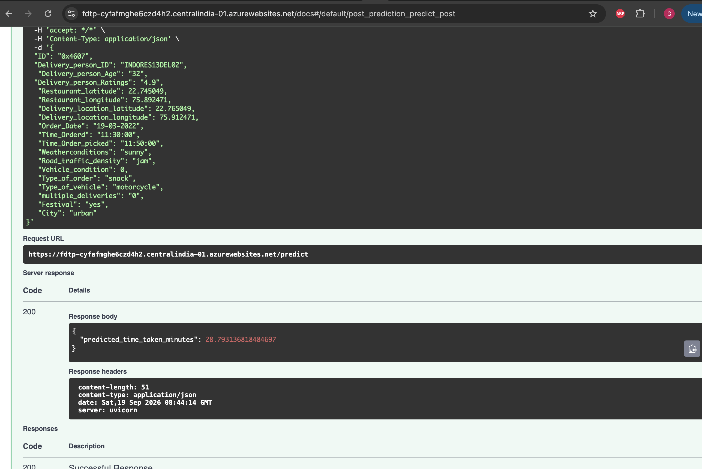
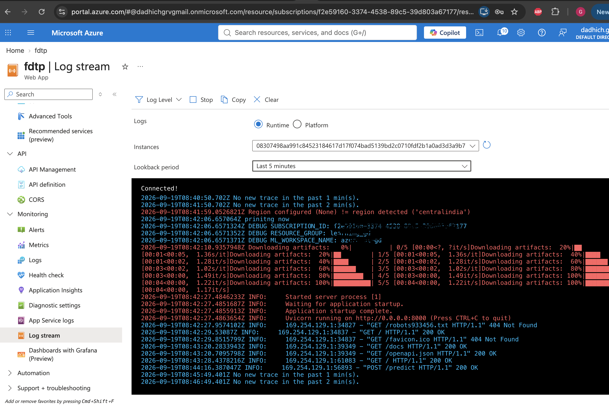
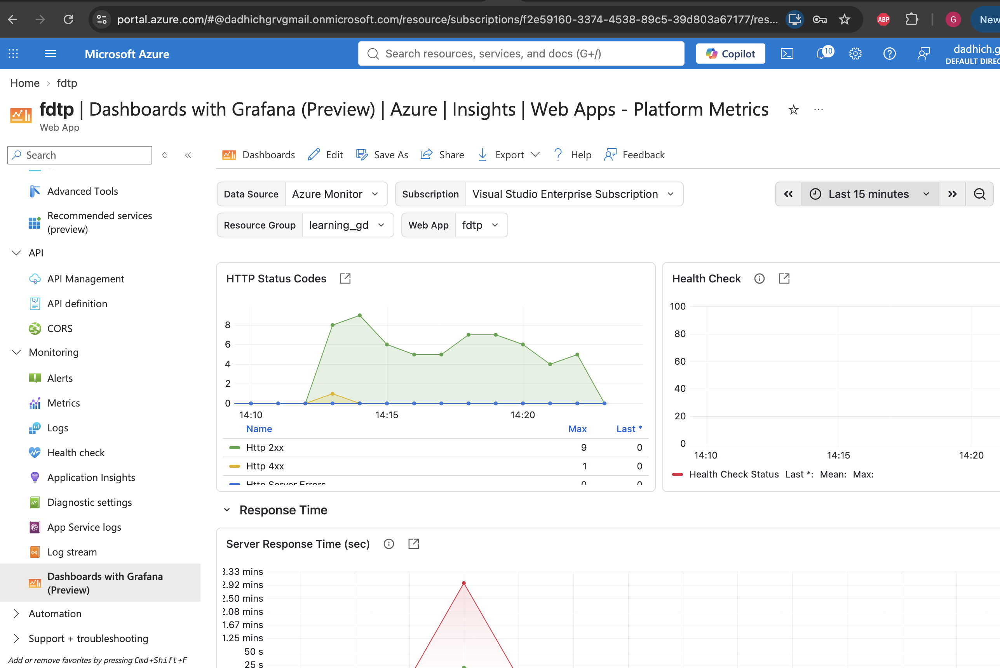

# Food Delivery Time Prediction

An end-to-end MLOps project that predicts food delivery time using a scikit-learn model, tracked with MLflow on Azure ML, served via FastAPI, containerized with Docker, and deployed to Azure App Service through a GitHub Actions CI/CD pipeline.

## Overview

- **Problem**: Predict delivery time (minutes) for a food order based on rider, weather, traffic, and location features.
- **Model**: scikit-learn regression pipeline (preprocessing + regressor), tracked and registered via MLflow on Azure ML.
- **Serving**: FastAPI app exposing a `/predict` endpoint.
- **Data versioning**: DVC, backed by Azure Blob Storage.
- **CI/CD**: GitHub Actions — pulls data, validates the registered model, builds a Docker image, pushes to Azure Container Registry, and deploys to Azure App Service.
- **Monitoring**: Application Insights + Grafana dashboard.

## Architecture


## Tech Stack

| Layer | Tool |
|---|---|
| Data versioning | DVC + Azure Blob Storage |
| Experiment tracking / registry | MLflow on Azure ML |
| Model | scikit-learn |
| API | FastAPI + Uvicorn |
| Containerization | Docker |
| Container registry | Azure Container Registry (ACR) |
| Hosting | Azure App Service (Web App for Containers) |
| CI/CD | GitHub Actions |
| Monitoring | Application Insights, Grafana |

## Project Structure

```
.
├── app.py                      # FastAPI application
├── Dockerfile
├── requirements-docker.txt
├── run_information.json        # Points to the registered MLflow model/run
├── models/
│   └── preprocessor.joblib
├── scripts/
│   └── data_clean_utils.py     # Feature engineering / cleaning logic
├── tests/
│   └── test_model_registry.py
├── dvc.yaml                    # DVC pipeline stages
└── .github/workflows/ci.yaml   # CI/CD pipeline
├── src/
│   └── data_ingestion.py       # Ingest Data from Azure Blob Storage
│   └── data_cleaning.py        # Clean Data 
│   └── feature_engineering.py  # Create Features
│   └── model_building.py       # Build Model Training
│   └── model_evaluation.py     # Evaluate Model
│   └── model_registry.py       # Register Model on Azure ML


```

## Local Setup

```bash
git clone <repo-url>
cd Food_Delivery_Time_Prediction
uv pip install --system -r requirements-docker.txt
```

Create a `.env` file with:
```
SUBSCRIPTION_ID=
RESOURCE_GROUP=
ML_WORKSPACE_NAME=
tenant_id=
AZURE_CLIENT_ID=
AZURE_CLIENT_SECRET=
AZURE_TENANT_ID=
```

Run locally:
```bash
uv run uvicorn app:app --host 0.0.0.0 --port 8000
```

## Running with Docker

```bash
docker build -t food-delivery-time-prediction .
docker run --env-file .env -p 8000:8000 food-delivery-time-prediction
```

## API

- `GET /` — health check
- `POST /predict` — returns predicted delivery time given order/rider/location details
- `GET /docs` — interactive Swagger UI
- `GET /redoc` — alternative API docs

## CI/CD Pipeline

Every push to `main` triggers:
1. Install dependencies
2. `dvc pull` — fetch versioned data/model artifacts from Azure Blob
3. Validate the registered production model (`tests/test_model_registry.py`)
4. Build and push a Docker image to Azure Container Registry
5. Deploy the new image to Azure App Service and restart

## Deployment

The app is deployed on **Azure App Service** (Web App for Containers), authenticating to Azure Container Registry via a system-assigned managed identity with the `AcrPull` role.

**Live deployment:**



## Monitoring

**Application logs (Log Stream):**



**Grafana dashboard:**



## Known Limitations / Notes

- The preprocessor and regressor must originate from the same training run to avoid feature-mismatch errors (see `run_information.json`, which pins the exact registered model version).
- `OneHotEncoder` categories are inferred at fit time; retraining on a different data split can shift encoded feature names.
